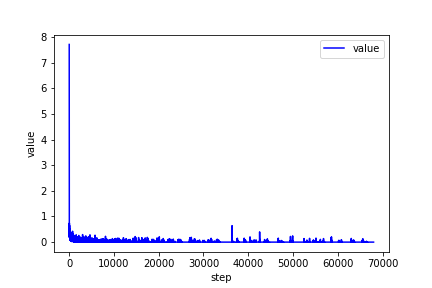
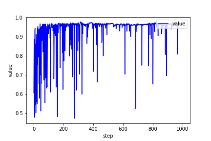
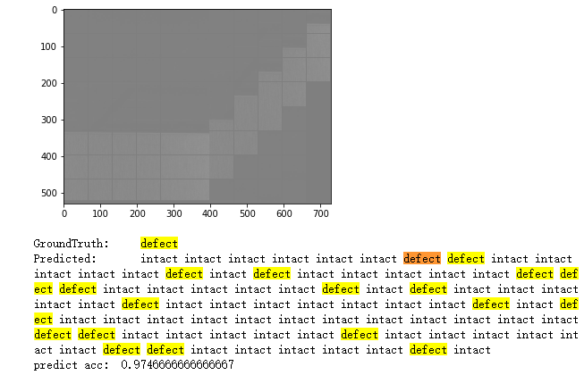

## 文件目录

develop_code_bk: 包含开发各个功能时写的一些demo代码，以及一些数据备份

tail_data/: 使用tail.ipynb对原图片进行裁剪缩放等处理，然后保存到此文件夹

train_data/: 保存训练用的原始图片数据

my_data_set.py: 包含MyDataset类，用于在训练前加载训练和测试数据

my_data_set_for_predict.py: 用于在预测前加载数据，可以将原始图片直接转换成可输入模型的数据

net.pkl: 用于保存训练好的模型，或者训练过程中的临时备份

predict.ipynb: 用于加载训练好的模型并计算预测准确度

tail.ipynb: 用于将原图片裁剪为训练集和测试集

tail_test.txt tail_train.txt: 训练集和测试集的标注信息

torchvision_resnet18.py: 官方的ResNet18模型模块

train.ipynb: 用于训练模型

train_log.txt: 记录训练过程中的loss, acc等信息

## 用法及流程

1.确保目录下含有以下文件：`train_data/`, `my_data_set.py`, `my_data_set_for_predict.py`, `predict.ipynb`, `tail.ipynb`, `torchvision_resnet18.py`, `train_labels.txt`, `train.ipynb`

2.用ipython notebook打开并运行`tail.ipynb`，会生成`tail_test.txt`, `tail_train.txt`, `tail_data/`

3.运行`train.ipynb`，生成`net.pkl`, `loss.png`, `acc.png`

4.运行`predict.ipynb`，得到预测准确率

## 效果展示

